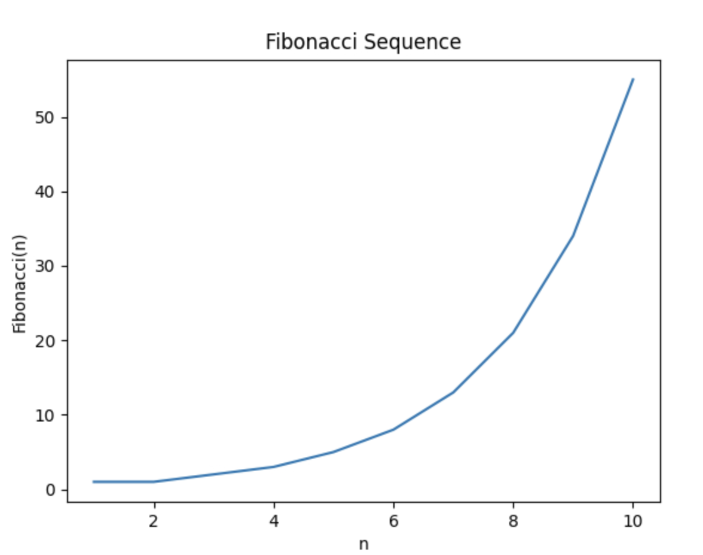

# Fibonacci Sequence Visualization


This project contains a Python script to compute and visualize the Fibonacci sequence using recursion, memoization, and the `matplotlib` library for plotting. The code uses an efficient caching mechanism to store previously calculated Fibonacci numbers, speeding up the computation of higher values in the sequence.

## Features

- **Fibonacci Sequence Calculation**: Computes the Fibonacci sequence up to the specified `n`.
- **Memoization**: Uses the `lru_cache` decorator from Python's `functools` module to cache computed Fibonacci numbers, improving performance.
- **Visualization**: Plots the sequence using `matplotlib` to illustrate the growth of Fibonacci numbers with increasing `n`.

## Prerequisites

- Python 3.x
- `matplotlib` library: Install with `pip install matplotlib` if not already installed.

## How to Use

1. Clone this repository or copy the script to your local machine.
2. Ensure `matplotlib` is installed in your Python environment.
3. Run the script with:

    ```bash
    python main.py
    ```

4. The program will display a plot showing the Fibonacci numbers for the first 10 values of `n`.

## Code Explanation

- **Caching with `@lru_cache`**: This decorator stores results of previous function calls, reducing the need for repeated calculations. Here, `@lru_cache(maxsize=1000)` caches up to 1000 results of the `fibonacci` function.
- **Recursive Function**: The `fibonacci(n)` function uses recursion to calculate the `n`th Fibonacci number:
    - If `n` is 1 or 2, the result is 1 (base cases).
    - Otherwise, the result is the sum of the previous two Fibonacci numbers.
- **Input Validation**: Ensures `n` is a positive integer to prevent calculation errors.
- **Plotting with `matplotlib`**: Generates a line plot showing Fibonacci values against the sequence index `n`.

## Example Output

The script plots the Fibonacci sequence values from `n = 1` to `n = 10`, displaying the familiar exponential growth of the sequence.


